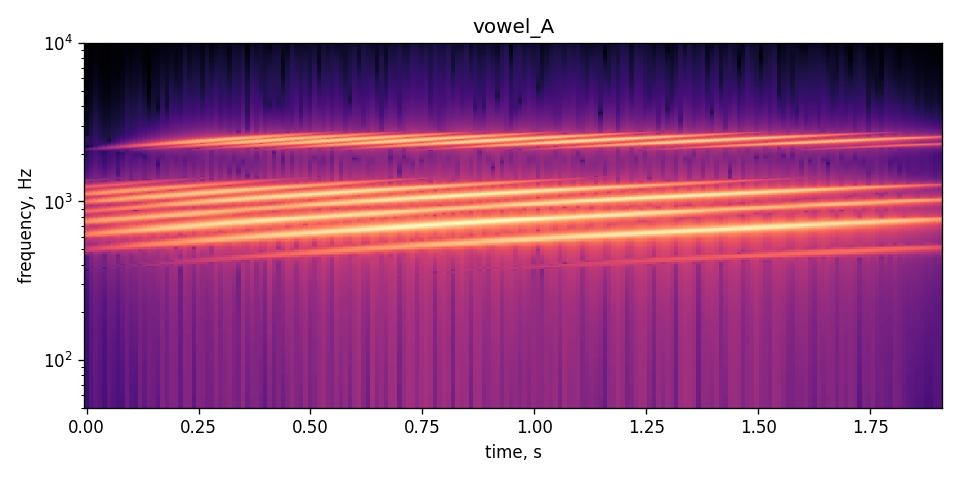
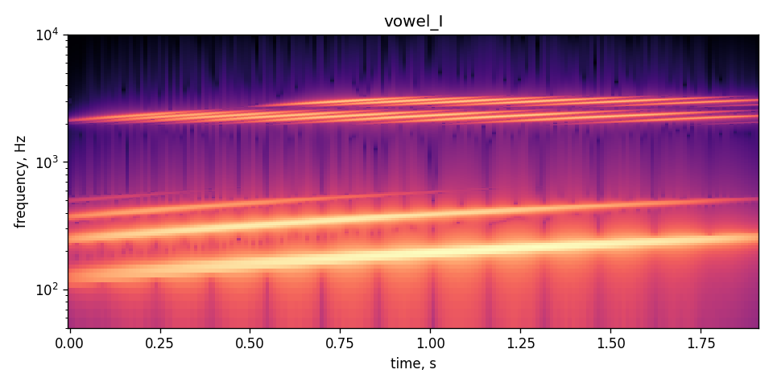
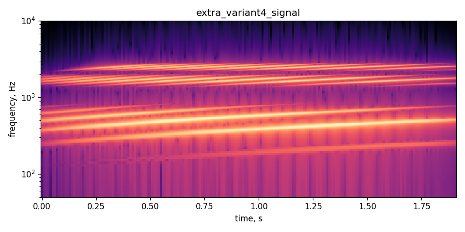

# Лабораторная работа №10
## Обработка голоса

### Вариант 4
В методичке перечислены варианты 1-3, отдельного варианта 4 нет. Поэтому выполнен общий анализ голосоподобных сигналов по требованиям работы: спектрограммы, частотный диапазон и форманты.

### Цель
Построить спектрограммы голосовых сигналов, определить частотный диапазон и найти три наиболее сильные форманты.

### Исходные данные
Так как запись с микрофона в рабочей среде недоступна, использованы синтетические голосоподобные сигналы:

1. `vowel_A.wav` - модель звука `А`;
2. `vowel_I.wav` - модель звука `И`;
3. `extra_variant4_signal.wav` - дополнительный сигнал для фиксации варианта 4.

Сигналы построены как гармонический источник с формантной огибающей.

### Метод
Для каждого файла строится спектрограмма с окном Ханна. Частоты визуализируются в логарифмической шкале. Минимальная и максимальная частота оцениваются по среднему спектру. Форманты выбираются как частоты с максимальной энергией в диапазоне 200-3500 Гц.

### Результаты
**Спектрограмма звука А**

**Спектрограмма звука И**

**Дополнительный сигнал**

Итоговая таблица сохранена в `output/voice_analysis.csv`.

### Вывод
Для звуков `А` и `И` получены разные наборы формант, что соответствует теоретическому различию гласных. Метод спектрального анализа позволяет оценить частотный диапазон и тембральные особенности голосового сигнала.
