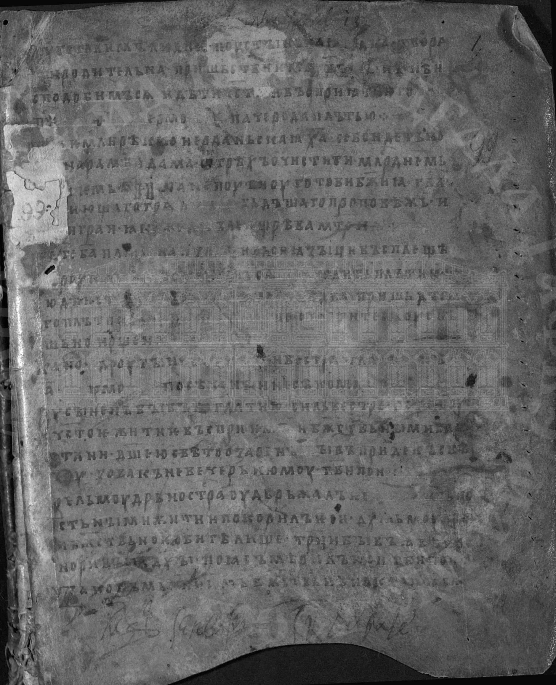
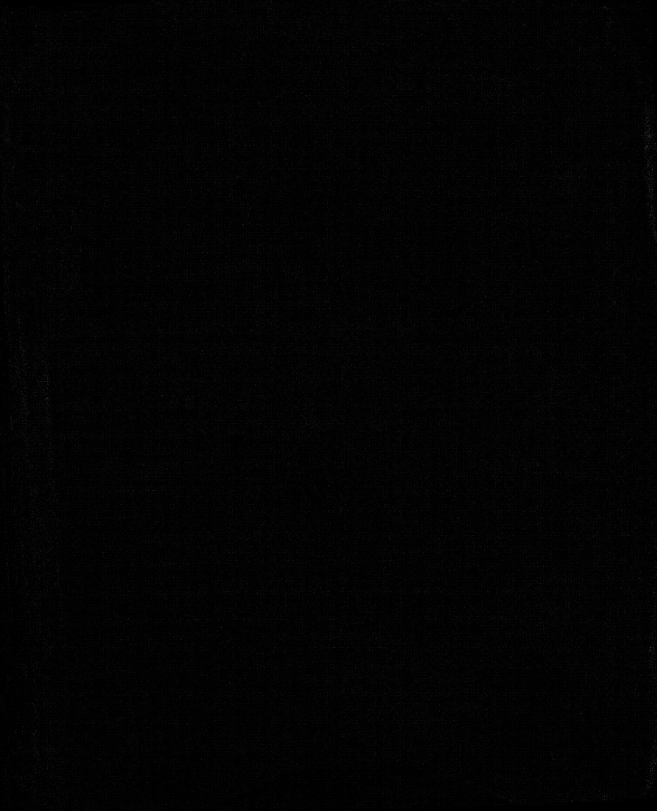

# Лабораторная работа №3
## Фильтрация изображений и морфологические операции

### Цель работы
Изучить методы пространственной фильтрации изображений и оценить результат обработки с помощью разностного изображения.

### Используемый метод
Для обработки использовался **медианный фильтр 3×3**.

Маска фильтра представляет собой равнину:

```text
Ω =
[1 1 1]
[1 1 1]
[1 1 1]
```

Для каждого пикселя рассматривается окно 3×3, после чего значения яркости внутри окна сортируются, и центральному пикселю результата присваивается медианное значение.

Медианный фильтр эффективен для подавления импульсного шума и мелких локальных выбросов, при этом он сохраняет границы объектов лучше, чем обычное усреднение.

### Разностное изображение
В соответствии с условием задания использовались два варианта разности:
- для монохромного изображения — **XOR** исходного и отфильтрованного изображения;
- для полутонового изображения — **модуль разности**:

```text
D = |I - F|
```

где `I` — исходное изображение, `F` — результат медианной фильтрации.

Для полутоновых изображений модуль разности часто получается слишком тёмным при прямом отображении. Поэтому:
- файл `*_diff_raw.png` содержит исходный модуль разности `|I - F|`;
- файл `*_diff.png` содержит ту же разность после дополнительного контрастирования умножением яркости на коэффициент 10.

### Исходные данные
Исходные изображения находятся в каталоге:

```text
lab3/../input_zhest/
```

Результаты обработки находятся в каталоге:

```text
lab3/output_images/
```

### Результаты обработки
Ниже показаны исходное изображение, результат фильтрации и наглядное разностное изображение `*_diff.png`. При необходимости исходная, неконтрастированная разность доступна в файле `*_diff_raw.png`.

#### Пример 1
**Исходное изображение**


**Результат медианного фильтра 3×3**



**Разностное изображение**


**Исходный модуль разности**



#### Пример 2
**Исходное изображение**


**Результат медианного фильтра 3×3**


**Разностное изображение**


**Исходный модуль разности**


### Вывод
В ходе лабораторной работы был реализован медианный фильтр с окном 3×3. Обработка показала, что данный фильтр эффективно подавляет мелкий шум и отдельные выбросы яркости. Для полутоновых изображений нагляднее использовать контрастированное разностное изображение, сохраняя при этом и исходный модуль разности для формального соответствия вычислениям.
