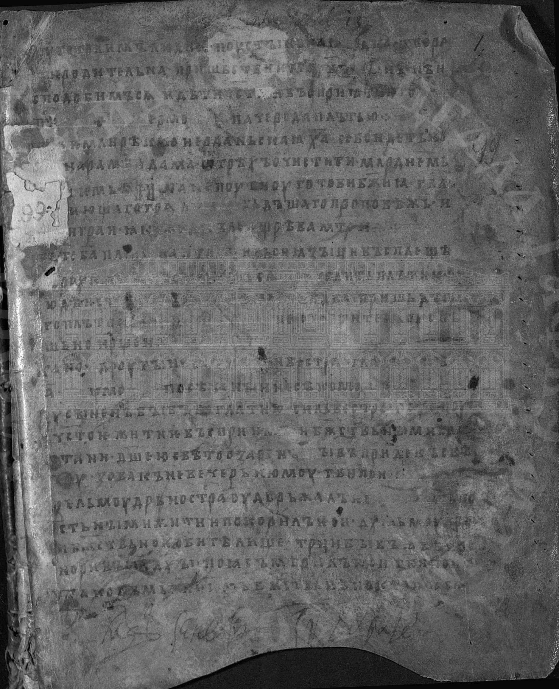
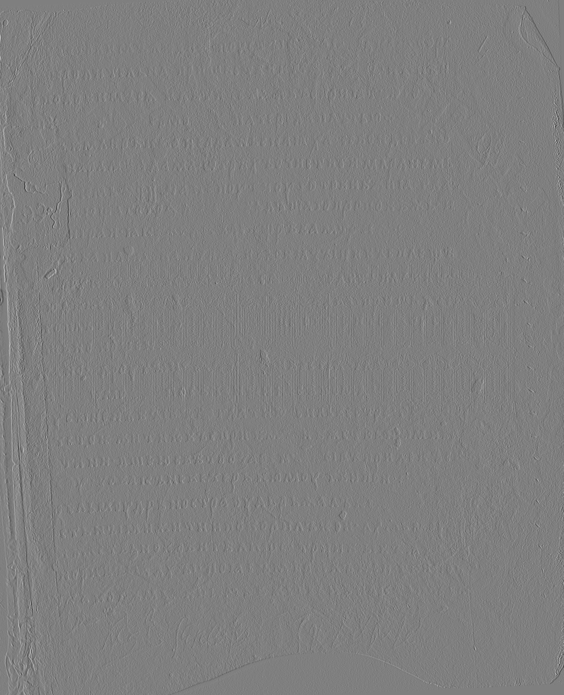
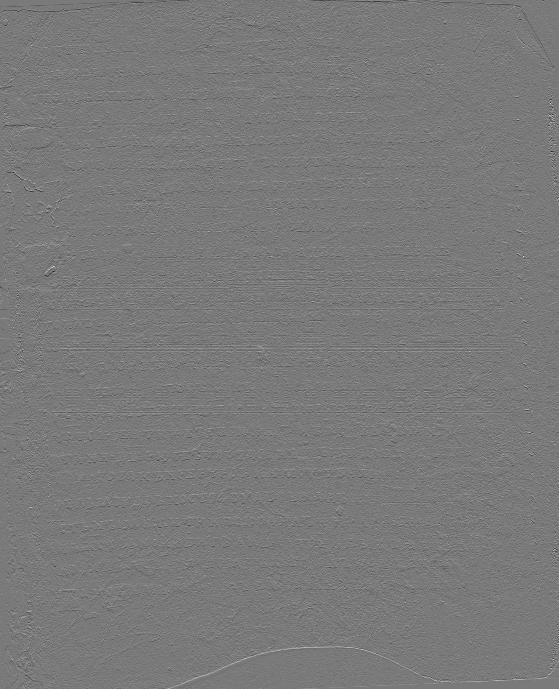
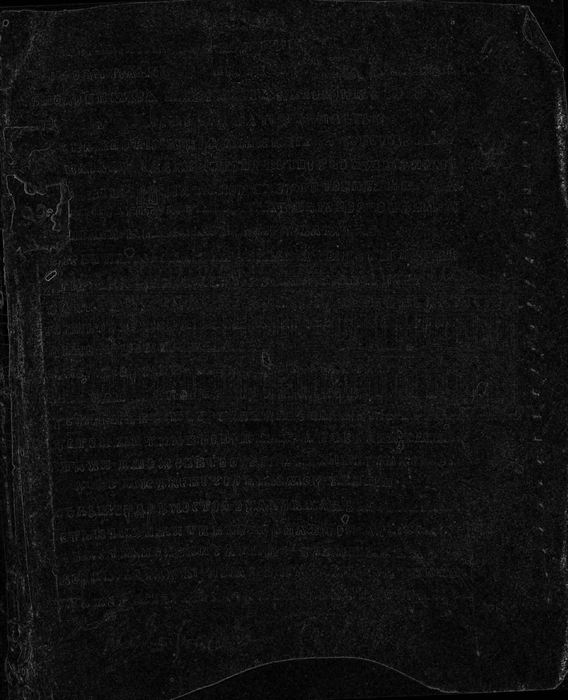
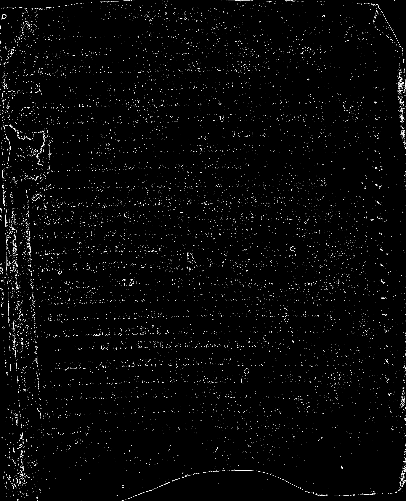
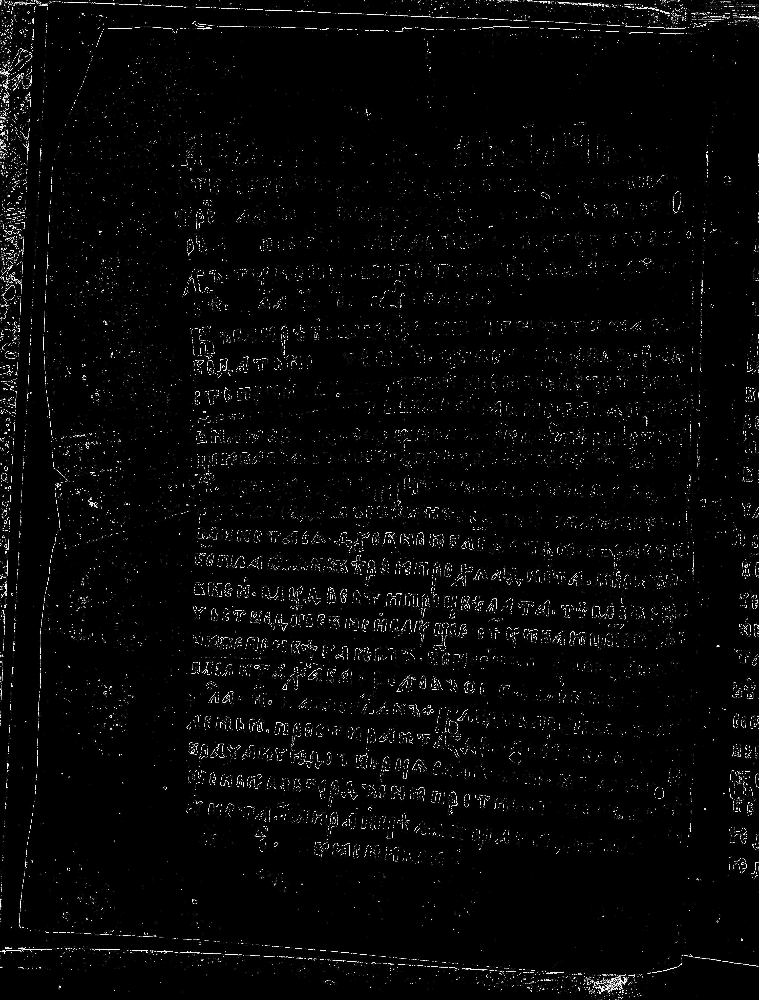

# Лабораторная работа №4
## Выделение контуров на изображении

### Цель работы
Реализовать выделение контуров на изображении с помощью оператора Собеля и построить градиентные матрицы по направлениям `Gx`, `Gy` и суммарный градиент `G`.

### Используемый метод
Если входное изображение было цветным, оно предварительно переводилось в полутоновое по формуле:

```text
Y = 0.299R + 0.587G + 0.114B
```

Далее применялся **оператор Собеля 3×3**.

Используемые маски:

```text
Gx =
[-1  0 +1]
[-2  0 +2]
[-1  0 +1]

Gy =
[+1 +2 +1]
[ 0  0  0]
[-1 -2 -1]
```

После свёртки вычислялись матрицы `Gx` и `Gy`, а затем итоговая градиентная матрица:

```text
G = |Gx| + |Gy|
```

Полученные матрицы нормализовались в диапазон яркости `0..255`. После этого матрица `G` бинаризовалась по порогу, подобранному экспериментально.

### Исходные данные
Исходные изображения находятся в каталоге:

```text
lab4/../input_zhest/
```

Результаты обработки находятся в каталоге:

```text
lab4/output_images/
```

### Результаты обработки
В отчёте должны быть показаны:
1. исходное цветное изображение;
2. полутоновое изображение;
3. градиентные матрицы `Gx`, `Gy`, `G`;
4. бинаризованная матрица `G`.

#### Пример 1
**Исходное изображение**


**Полутоновое изображение**



**Градиентная матрица Gx**



**Градиентная матрица Gy**



**Градиентная матрица G**



**Бинаризованная матрица G**



#### Пример 2
**Исходное изображение**


**Полутоновое изображение**


**Градиентная матрица Gx**


**Градиентная матрица Gy**


**Градиентная матрица G**


**Бинаризованная матрица G**



### Вывод
В ходе лабораторной работы было выполнено выделение контуров на изображении с помощью оператора Собеля 3×3. Использование матриц `Gx` и `Gy` позволило определить изменение яркости по горизонтальному и вертикальному направлениям, а вычисление `G = |Gx| + |Gy|` позволило получить итоговую карту контуров. Бинаризация матрицы `G` делает контуры более наглядными и удобными для последующего анализа.
