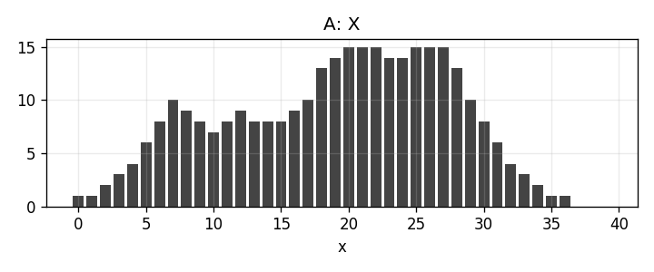
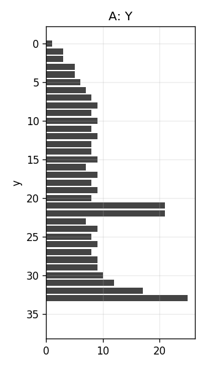
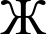
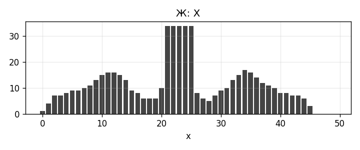
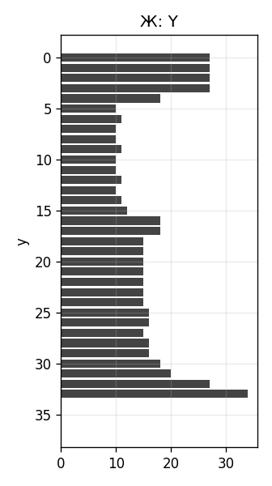

# Лабораторная работа №5
## Выделение признаков символов

### Вариант 4
Алфавит: кириллица заглавная

```text
АБВГДЕЖЅЗИIКЛМНОПРСТѸФХЦЧШЩЪЫЬѢЮѴѮѰѠѲѦѪ
```

### Цель
Сгенерировать эталонные изображения символов выбранного алфавита и рассчитать набор признаков для каждого символа.

### Метод
Символы сгенерированы шрифтом 52 pt и сохранены по принципу один символ - один файл в папку `symbols`.

Для каждого изображения рассчитаны:

1. масса черного каждой четверти;
2. удельный вес каждой четверти;
3. координаты центра тяжести;
4. нормированные координаты центра тяжести;
5. осевые моменты инерции по горизонтали и вертикали;
6. нормированные осевые моменты инерции;
7. профили X и Y.

Скалярные признаки сохранены в `output/features.csv`. Профили сохранены в `profiles`.

### Примеры
**Символ А**


**Профиль X**



**Профиль Y**



**Символ Ж**



**Профиль X**



**Профиль Y**



### Вывод
Для алфавита варианта 4 сформирован набор эталонных изображений и таблица признаков. Эти данные используются в последующих работах для сегментации и классификации символов.
