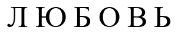
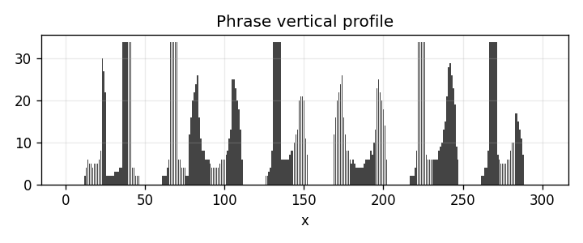
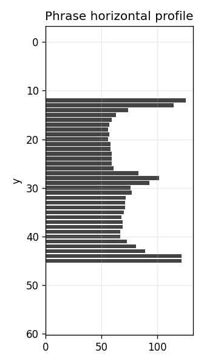
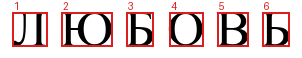

# Лабораторная работа №6
## Сегментация текста

### Вариант 4
Используется тот же алфавит, что в лабораторной работе №5: кириллица заглавная.

### Цель
Подготовить монохромное изображение фразы, построить горизонтальный и вертикальный профили и выполнить сегментацию символов на основе профилей.

### Исходная фраза

```text
ЛЮБОВЬ
```

Изображение фразы сохранено в `output/phrase.bmp`.

### Метод
Вертикальный профиль рассчитывается как сумма черных пикселей в каждом столбце, горизонтальный профиль - как сумма черных пикселей в каждой строке. Границы символов выбираются по участкам вертикального профиля, где значение равно нулю. Для каждого найденного символа вычисляется обрамляющий прямоугольник.

### Результаты
**Исходная фраза**



**Вертикальный профиль**



**Горизонтальный профиль**



**Сегментация**



Координаты прямоугольников сохранены в `output/segments.csv`, вырезанные символы сохранены в `segments`.

### Вывод
Алгоритм сегментации на основе профилей корректно выделяет символы печатной строки при наличии межбуквенных просветов. Для курсивных или слитных символов потребуется пороговая сегментация или проекция на наклонную ось.
