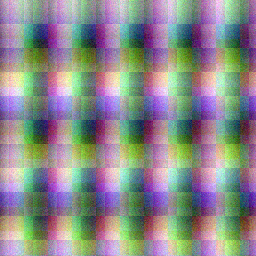
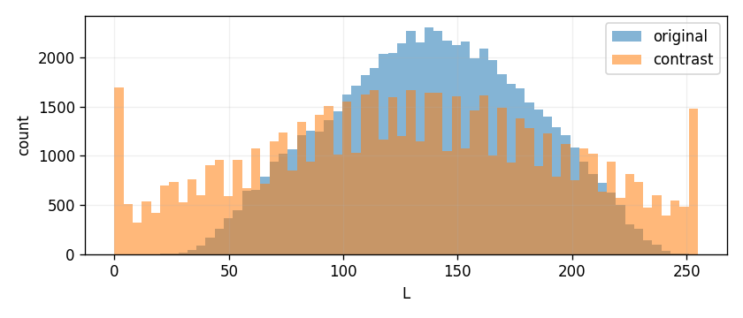
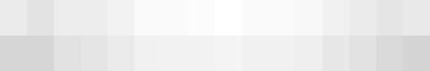

# Лабораторная работа №8
## Текстурный анализ и контрастирование

### Вариант 4
Матрица: `NGTDM`, параметр `d = 1`.

Признаки: `COS`, `CON`, `BUS`.

Метод преобразования яркости: линейное контрастирование.

### Цель
Построить NGTDM-матрицу для изображений, рассчитать текстурные признаки до и после линейного контрастирования и сравнить результат.

### Метод
Изображение переводится в полутоновое. Яркость квантуется на 16 уровней. Для каждого пикселя, у которого есть окрестность радиуса `d = 1`, считается отличие уровня пикселя от среднего уровня соседей. По этим значениям строится NGTDM.

Линейное контрастирование выполняется растяжением яркости по 2-му и 98-му процентилям.

### Результаты
Для каждого изображения сохранены:

1. исходное изображение;
2. полутоновое изображение;
3. контрастированное полутоновое изображение;
4. гистограммы яркости до и после преобразования;
5. NGTDM-матрицы до и после преобразования.

Сводная таблица признаков сохранена в `output/ngtdm_features.csv`.

Пример для синтетической текстуры:

### Вывод
Линейное контрастирование изменяет распределение яркости и, как следствие, значения текстурных признаков NGTDM. Признаки `COS`, `CON` и `BUS` позволяют численно сравнить исходную и контрастированную текстуру.
