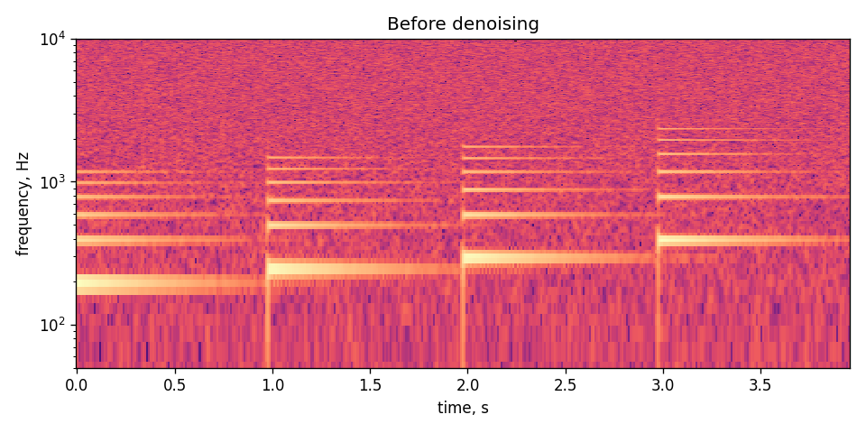
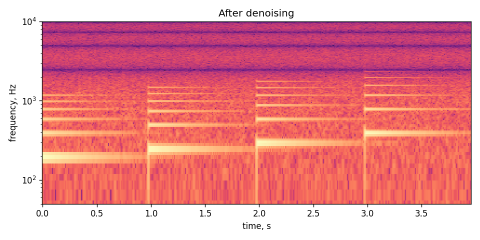

# Лабораторная работа №9
## Анализ шума

### Цель
Построить спектрограмму музыкального сигнала, оценить уровень шума, выполнить простое шумоподавление и найти интервалы с максимальной энергией.

### Исходные данные
Так как запись с микрофона в рабочей среде недоступна, использован синтетический сигнал, имитирующий щипковый музыкальный инструмент. В сигнал добавлен шум. Файл сохранен как `output/instrument_noisy.wav`.

### Метод
Спектрограмма строится оконным преобразованием Фурье с окном Ханна. Для шумоподавления используется сглаживание скользящим средним. Оценка шума рассчитывается как стандартное отклонение разности между исходным и сглаженным сигналом.

Энергия анализируется по временным интервалам около `0.1 с` и частотным полосам около `50 Гц`.

### Результаты
**Спектрограмма до шумоподавления**



**Спектрограмма после шумоподавления**



Файлы:

```text
output/instrument_noisy.wav
output/instrument_denoised.wav
output/noise_summary.csv
output/energy_peaks.csv
```

### Вывод
После сглаживания уменьшается высокочастотная шумовая составляющая. Таблица `energy_peaks.csv` показывает моменты времени и частотные полосы, где наблюдается максимальная энергия сигнала.
